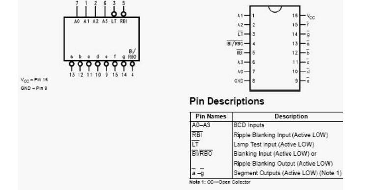

## 74LS90

[74ls90引脚图及功能](http://www.createstar.net/english/news/10/590.html)

[74ls90任意进制计数器](https://www.docin.com/p-1172492147.html)

## 74LS47 BCD-7段数码管译码器

- LT：试灯输入，低电平有效。
- BI：灭灯输入，优先级最高，低电平有效，有效时熄灭所有灯管输出。
- RBI：灭零输入，若输出均为0，则灭灯。
- RBO：灭零输出，与BI共用一端，为多数码管显示提供其他位灭零的功能。
- A0-A3：输入引脚。