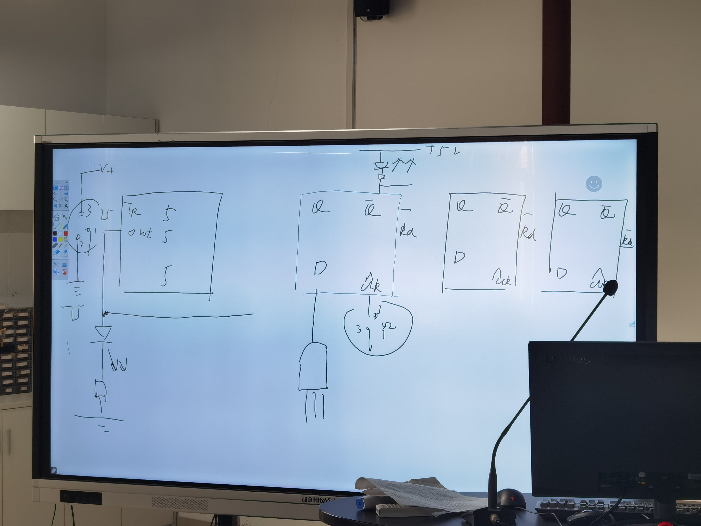

# 抢答电路设计

## 设计要求

主持人宣布抢答开始，主持人灯亮，定时5秒，抢答成功后自己的灯亮，并锁死其他的灯，直到下一次主持人开始

超时后再抢答也无效

## 设计思路

### 预备知识
波动开关：
1. 动触头
2. 常断触头
3. 常通触头

常通：不按按键时接通的端口

### 电路结构
555单稳态定时电路，由主持人信号触发

主持人触发后：
1. 清零 - 给到触发器复位端（低电平有效）
2. 导通输入

有人按键后：
1. 触发器触发，维持自己灯亮
2. 封死别人的输入端

预习：multisim中搭建电路，做仿真。

## Reference

### 74LS74

### 74HC11

